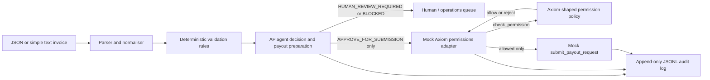

# Axiom AP / payout-agent prototype

[](https://github.com/ANKOHR/axiom-ap-agent-prototype/actions/workflows/ci.yml)

This is a compact technical-trial prototype for an accounts-payable and payout workflow. It demonstrates how an agent can interpret an invoice, run deterministic checks, prepare a structured payout request, and record an auditable recommendation while a separate Axiom boundary remains the authority over submission.

It is deliberately not a production payments system. The original demo uses a mocked Axiom permissions adapter; a separate, explicitly invoked staging adapter is prepared for the Axiom trial. The data is synthetic, no credentials are stored, and no money moves.

## 60-second reviewer path

1. Read the [five-case demo transcript](demo-transcript.txt) to see the agent/review/permission outcomes immediately.
2. Read the [staging-readiness report](docs/axiom-staging-readiness.md) for the exact execution-authority, idempotency and secret-handling boundaries.
3. Run `python -m pytest -q` and `python -m src.main --demo` for the deterministic offline proof.
4. Inspect [CI](https://github.com/ANKOHR/axiom-ap-agent-prototype/actions/workflows/ci.yml): tests, compile checks, the offline demo and the staging dry-run execute without credentials or real payment side effects.

The key engineering point is the authority split: the agent may recommend submission, but a separate permission boundary remains authoritative over whether the action can proceed.

## What it demonstrates

- Structured JSON input plus a small `Field: value` text format.
- Normalisation of supplier, invoice, amount, currency, due date, destination, reference, and requestor fields.
- Deterministic required-field, supplier, duplicate, threshold, currency, bank-change, amount-format, and optional local requestor-policy checks.
- Three explicit agent decisions:
  - `APPROVE_FOR_SUBMISSION`
  - `HUMAN_REVIEW_REQUIRED`
  - `BLOCKED`
- A structured payout request representing the payload that could later be submitted to Axiom.
- A mocked `check_permission(...)` and `submit_payout_request(...)` boundary for the offline demo.
- A separate Axiom staging `payment.create` adapter with runtime passport handling, idempotency, request-ID mapping, and redacted evidence reporting.
- Append-only JSONL audit records containing input, normalisation, checks, evidence, decision, permission result, outcome, timestamp, and request ID.

## Architecture and trust boundary



The trust boundary is intentional:

- **Agent:** interprets, normalises, validates, explains, recommends, and prepares a payout request.
- **Axiom boundary:** independently checks delegated authority and payment policy, then decides whether the proposed action may be submitted.
- **This prototype:** simulates that boundary in memory for the offline demo. The prepared staging adapter hands the proposal to Axiom; it does not reproduce Axiom's final policy locally or execute a settled payment.

The most important demonstration is case 5: the agent recommends submission because the amount is below its own automatic threshold, but the mocked Axiom permission layer rejects it because the requestor's permitted limit is lower. Agent reasoning is therefore not treated as execution authority.

## Install and run

Runtime code uses only the Python standard library. From this project directory:

```powershell
python -m venv .venv
.\.venv\Scripts\Activate.ps1
python -m pip install -e ".[dev]"
```

Run the complete demo:

```powershell
python -m src.main --demo
```

The demo prints a readable summary and appends complete records to `audit/audit.jsonl`. To process one request file:

```powershell
python -m src.main --request sample_requests\case-1-normal.json
python -m src.main --request sample_requests\simple-text-invoice.txt
```

Use a different audit destination when you want an isolated run:

```powershell
python -m src.main --demo --audit-file audit\trial-run.jsonl
```

## Axiom staging trial readiness

The repository is ready for the governed live staging test. Start an asynchronous review with the [technical staging-readiness report](docs/axiom-staging-readiness.md) and the [clean local dry-run transcript](docs/axiom-staging-dry-run-transcript.md); both label simulated/local evidence separately from live Axiom evidence.

- Wire contract: `POST https://api-staging.axiomgo.ai/v1/invoke`, action `payment.create`, four payment params, required JSON/Accept/idempotency headers.
- Trust boundary: the AP runner decides commercial suitability; Axiom independently decides delegated authority and payment policy.
- Safety: the passport is read only from `AXIOM_AGENT_PASSPORT` at request time, redacted from evidence, and never placed in Git or generated audit files. The five cases run sequentially with no automatic retries.
- Correlation: the local `agent_job_id` stays out of the body and is mapped to any returned Axiom `request_id`; replay and mismatch reuse the allowed case's idempotency key as specified.
- Exact cases: allowed payment; blocked merchant; blocked amount; idempotent replay; idempotency mismatch.

Safe offline verification:

```powershell
python -m pytest -q
python -m compileall -q src tests
python -m src.main --demo --audit-file audit\offline-review.jsonl
python -m src.main --staging-suite --dry-run --staging-report audit\staging-dry-run.json
```

The hidden-prompt live runbook, evidence fields, expected checks, and remaining Axiom-only observations are in the readiness report. If the live command starts without a passport, it fails safely before network I/O and exits nonzero.

## Demo scenarios

| Case | Input | Expected agent decision | Expected final outcome |
| --- | --- | --- | --- |
| 1 | Known supplier, valid amount, permitted requestor | `APPROVE_FOR_SUBMISSION` | Mock Axiom accepts |
| 2 | Unknown supplier | `HUMAN_REVIEW_REQUIRED` | Held for human review |
| 3 | Existing supplier/invoice combination | `BLOCKED` | Blocked by agent validation |
| 4 | Supplier bank details differ from known record | `HUMAN_REVIEW_REQUIRED` | Held for human review |
| 5 | Agent threshold passes, requestor limit fails | `APPROVE_FOR_SUBMISSION` | Mock Axiom rejects permission |

The sample records in `data/` and the sample requests are synthetic fixtures intended for demonstrations and tests only.

## Example output

The request ID and mock reference are generated per run, so the exact values vary:

```text
CASE 1 - normal approved supplier
  request_id: req-...
  agent_decision: APPROVE_FOR_SUBMISSION
  checks: PASS=...
  axiom_mock_permission: ALLOWED
  final_outcome: ACCEPTED_BY_AXIOM_MOCK

CASE 5 - agent approval, Axiom permission rejection
  request_id: req-...
  agent_decision: APPROVE_FOR_SUBMISSION
  axiom_mock_permission: REJECTED
  axiom_mock_reason: Axiom mock policy rejects the amount for this requestor.
  final_outcome: REJECTED_BY_AXIOM_PERMISSION
```

The JSONL audit record is the authoritative detailed output. It includes the checks and evidence behind each line rather than relying on the console summary.

For a quick review, [demo-transcript.txt](demo-transcript.txt) contains the concise terminal transcript from a verified five-case run, including the agent-approved/Axiom-rejected boundary in case 5.

## Tests

Run:

```powershell
python -m pytest -q
```

The tests cover duplicate detection, supplier validation, thresholds, bank-detail mismatch, amount consistency, optional requestor policies, mock permission rejection, one-time permission tokens, end-to-end decisions, audit generation, staging request shape, forbidden-field exclusion, idempotency keys, Axiom request-ID mapping, secret redaction, replay, and idempotency mismatch handling.

## What is mocked

- The supplier allowlist, previous-invoice register, approval thresholds, and requestor policies are local JSON fixtures.
- `MockAxiomPermissions` stands in for an Axiom permissions/control API in the offline demo.
- `check_permission` issues an in-memory, request-bound mock token.
- `submit_payout_request` creates a mock reference only after an allowed permission check.
- The staging suite is the only network-capable path, and it is not called by the synthetic demo or tests. The staging endpoint is a test-mode integration path; there is no bank connection, settlement, webhook, or production execution path.

## Axiom staging adapter boundary

The clean replacement point for the real trial is the separate `AxiomStagingAdapter`; the offline `APAgent` contract remains unchanged:

1. Keep AP commercial suitability separate from Axiom's delegated-authority and payment-policy decisions.
2. Map the prepared proposal to the documented `payment.create` request shape without adding an execution bypass or local copies of Axiom policy.
3. Keep the short-lived `AXIOM_AGENT_PASSPORT` environment value in memory only for the request; persist only the redacted body and safe response evidence.
4. Map Axiom's returned `request_id` to the local `agent_job_id`; treat acceptance as a staging workflow state, not proof that a bank has settled funds.
5. Preserve the contract tests for denied merchants, amount limits, duplicate/idempotency behaviour, timeouts, and partial failures as the sandbox evolves.

The adapter should be the only code that knows transport details, authentication, Axiom endpoint names, or Axiom-specific status codes. The deterministic agent and its tests should remain usable without credentials.

## Security and safety considerations

- Never place production bank details or credentials in the fixture files.
- Validate and normalise all external input before it reaches an adapter.
- Keep duplicate detection and bank-change alerts explainable and auditable.
- Use the agreed idempotency key and preserve the local-to-Axiom request-ID mapping on every staging submission.
- Keep `AXIOM_AGENT_PASSPORT` runtime-only; redaction is applied to response bodies, response headers, exceptions, console output, and reports.
- Do not treat an agent recommendation, an API request, or an API acceptance response as proof of payment settlement.
- Add least-privilege authentication, secret storage, TLS, replay protection, rate limits, approval segregation, and immutable/retained audit storage before any real integration.
- Keep human approval explicit for new suppliers, bank changes, threshold exceptions, and ambiguous data.

## Obvious next steps after Axiom API access

1. Run the prepared five-case suite during the agreed one-hour window with the short-lived passport.
2. Confirm Axiom's identity, approval, idempotency, retry, and evidence semantics against the returned responses and report.
3. Review the audit trail jointly before discussing any production scope.

## Project tree

```text
axiom-ap-agent/
├── README.md
├── demo-transcript.txt
├── pyproject.toml
├── data/
│   ├── permissions.json
│   ├── previous_invoices.json
│   ├── rules.json
│   └── suppliers.json
├── sample_requests/
│   ├── case-1-normal.json
│   ├── case-2-unknown-supplier.json
│   ├── case-3-duplicate.json
│   ├── case-4-bank-change.json
│   ├── case-5-permission-rejection.json
│   └── simple-text-invoice.txt
├── src/
│   ├── __init__.py
│   ├── main.py
│   └── axiom_ap_agent/
│       ├── __init__.py
│       ├── agent.py
│       ├── audit.py
│       ├── axiom_staging.py
│       ├── main.py
│       ├── models.py
│       ├── parser.py
│       ├── permissions.py
│       ├── staging_runner.py
│       ├── staging_scenarios.py
│       └── validator.py
└── tests/
    ├── test_permissions.py
    ├── test_staging_adapter.py
    ├── test_staging_runner.py
    ├── test_validation.py
    └── test_workflow.py
```
