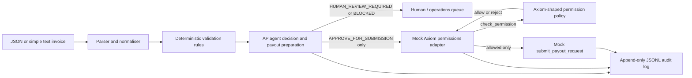

# Axiom AP / payout-agent prototype

This is a compact technical-trial prototype for an accounts-payable and payout workflow. It demonstrates how an agent can interpret an invoice, run deterministic checks, prepare a structured payout request, and record an auditable recommendation while a separate Axiom-shaped permissions adapter remains the authority over submission.

It is deliberately not a production payments system. The data is synthetic, the Axiom adapter is mocked, no credentials are used, and no money moves.

## What it demonstrates

- Structured JSON input plus a small `Field: value` text format.
- Normalisation of supplier, invoice, amount, currency, due date, destination, reference, and requestor fields.
- Deterministic required-field, supplier, duplicate, threshold, currency, bank-change, amount-format, and optional local requestor-policy checks.
- Three explicit agent decisions:
  - `APPROVE_FOR_SUBMISSION`
  - `HUMAN_REVIEW_REQUIRED`
  - `BLOCKED`
- A structured payout request representing the payload that could later be submitted to Axiom.
- A mocked `check_permission(...)` and `submit_payout_request(...)` boundary.
- Append-only JSONL audit records containing input, normalisation, checks, evidence, decision, permission result, outcome, timestamp, and request ID.

## Architecture and trust boundary



The trust boundary is intentional:

- **Agent:** interprets, normalises, validates, explains, recommends, and prepares a payout request.
- **Axiom boundary:** independently checks the requestor's authority, currency scope, and amount limit, then decides whether the proposed action may be submitted.
- **This prototype:** simulates the Axiom boundary in memory. It does not authenticate, call a banking API, or execute a payment.

The most important demonstration is case 5: the agent recommends submission because the amount is below its own automatic threshold, but the mocked Axiom permission layer rejects it because the requestor's permitted limit is lower. Agent reasoning is therefore not treated as execution authority.

## Install and run

Runtime code uses only the Python standard library. From this project directory:

```powershell
python -m venv .venv
.\.venv\Scripts\Activate.ps1
python -m pip install -e ".[dev]"
```

Run the complete demo:

```powershell
python -m src.main --demo
```

The demo prints a readable summary and appends complete records to `audit/audit.jsonl`. To process one request file:

```powershell
python -m src.main --request sample_requests\case-1-normal.json
python -m src.main --request sample_requests\simple-text-invoice.txt
```

Use a different audit destination when you want an isolated run:

```powershell
python -m src.main --demo --audit-file audit\trial-run.jsonl
```

## Demo scenarios

| Case | Input | Expected agent decision | Expected final outcome |
| --- | --- | --- | --- |
| 1 | Known supplier, valid amount, permitted requestor | `APPROVE_FOR_SUBMISSION` | Mock Axiom accepts |
| 2 | Unknown supplier | `HUMAN_REVIEW_REQUIRED` | Held for human review |
| 3 | Existing supplier/invoice combination | `BLOCKED` | Blocked by agent validation |
| 4 | Supplier bank details differ from known record | `HUMAN_REVIEW_REQUIRED` | Held for human review |
| 5 | Agent threshold passes, requestor limit fails | `APPROVE_FOR_SUBMISSION` | Mock Axiom rejects permission |

The sample records in `data/` and the sample requests are synthetic fixtures intended for demonstrations and tests only.

## Example output

The request ID and mock reference are generated per run, so the exact values vary:

```text
CASE 1 - normal approved supplier
  request_id: req-...
  agent_decision: APPROVE_FOR_SUBMISSION
  checks: PASS=...
  axiom_mock_permission: ALLOWED
  final_outcome: ACCEPTED_BY_AXIOM_MOCK

CASE 5 - agent approval, Axiom permission rejection
  request_id: req-...
  agent_decision: APPROVE_FOR_SUBMISSION
  axiom_mock_permission: REJECTED
  axiom_mock_reason: Axiom mock policy rejects the amount for this requestor.
  final_outcome: REJECTED_BY_AXIOM_PERMISSION
```

The JSONL audit record is the authoritative detailed output. It includes the checks and evidence behind each line rather than relying on the console summary.

For a quick review, [demo-transcript.txt](demo-transcript.txt) contains the concise terminal transcript from a verified five-case run, including the agent-approved/Axiom-rejected boundary in case 5.

## Tests

Run:

```powershell
python -m pytest -q
```

The tests cover duplicate detection, supplier validation, thresholds, bank-detail mismatch, amount consistency, optional requestor policies, mock permission rejection, one-time permission tokens, end-to-end decisions, and audit generation.

## What is mocked

- The supplier allowlist, previous-invoice register, approval thresholds, and requestor policies are local JSON fixtures.
- `MockAxiomPermissions` stands in for an Axiom permissions/control API.
- `check_permission` issues an in-memory, request-bound mock token.
- `submit_payout_request` creates a mock reference only after an allowed permission check.
- There is no network call, authentication, webhook, bank connection, payment-provider call, or real execution path.

## Replacing the mock with a real Axiom adapter

If Axiom provides API documentation and credentials for a sandbox, the clean replacement point is the adapter supplied to `APAgent`:

1. Keep the `check_permission(payout_request)` and `submit_payout_request(payout_request, permission)` contract.
2. Map the prepared `PayoutRequest` to Axiom's documented request schema without allowing the agent to add an execution bypass.
3. Carry Axiom's real decision, policy version, approval requirements, idempotency key, and evidence identifiers into `PermissionResult` and the audit record.
4. Treat an API acceptance response as an Axiom workflow state, not as proof that a bank has settled funds.
5. Add sandbox contract tests for denied requestors, amount limits, duplicate/idempotency behaviour, retries, timeouts, and partial failures.

The adapter should be the only code that knows transport details, authentication, Axiom endpoint names, or Axiom-specific status codes. The deterministic agent and its tests should remain usable without credentials.

## Security and safety considerations

- Never place production bank details or credentials in the fixture files.
- Validate and normalise all external input before it reaches an adapter.
- Keep duplicate detection and bank-change alerts explainable and auditable.
- Use an idempotency key/request ID when a real submission endpoint is introduced.
- Do not treat an agent recommendation, an API request, or an API acceptance response as proof of payment settlement.
- Add least-privilege authentication, secret storage, TLS, replay protection, rate limits, approval segregation, and immutable/retained audit storage before any real integration.
- Keep human approval explicit for new suppliers, bank changes, threshold exceptions, and ambiguous data.

## Obvious next steps after Axiom API access

1. Replace `MockAxiomPermissions` with a sandbox adapter based on the actual permission, submission, and status schemas; preserve the same interface and add contract tests.
2. Confirm Axiom's identity, approval, idempotency, retry, and evidence semantics, then encode them in the audit schema and failure-state handling.
3. Run a small non-monetary or sandbox trial with agreed fixtures and review the audit trail jointly before discussing any production scope.

## Project tree

```text
axiom-ap-agent/
├── README.md
├── demo-transcript.txt
├── pyproject.toml
├── data/
│   ├── permissions.json
│   ├── previous_invoices.json
│   ├── rules.json
│   └── suppliers.json
├── sample_requests/
│   ├── case-1-normal.json
│   ├── case-2-unknown-supplier.json
│   ├── case-3-duplicate.json
│   ├── case-4-bank-change.json
│   ├── case-5-permission-rejection.json
│   └── simple-text-invoice.txt
├── src/
│   ├── __init__.py
│   ├── main.py
│   └── axiom_ap_agent/
│       ├── __init__.py
│       ├── agent.py
│       ├── audit.py
│       ├── main.py
│       ├── models.py
│       ├── parser.py
│       ├── permissions.py
│       └── validator.py
└── tests/
    ├── test_permissions.py
    ├── test_validation.py
    └── test_workflow.py
```
